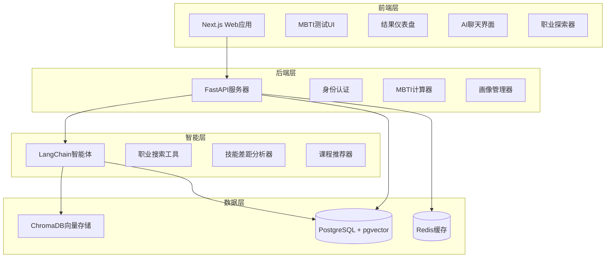
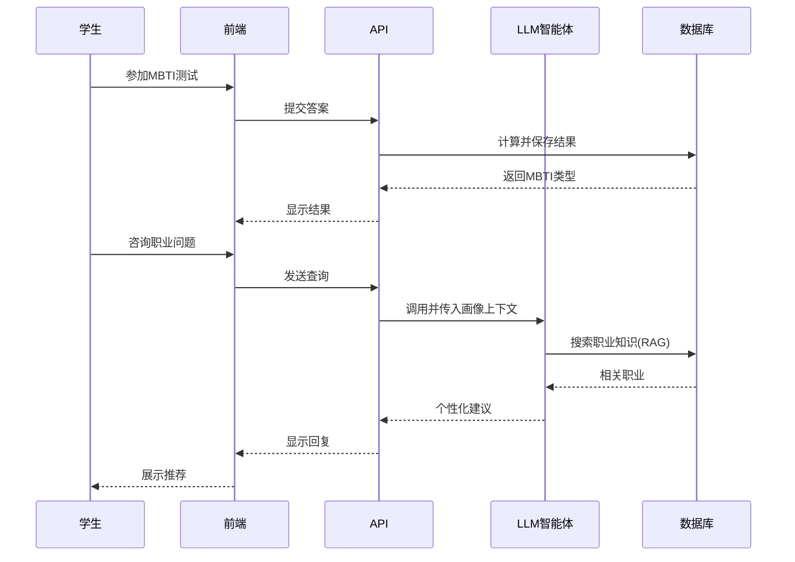

# 学生画像分析系统 - 项目指南

## 项目概述

我设计了一个全面的**学生画像分析系统**，将**MBTI性格评估**与**AI驱动的职业规划**相结合。该系统专门为大学生量身定制，利用现代AI技术提供个性化、可操作的职业指导。

---

## 1. 研究成果

### 1.1 案例分析

我研究了几个现有的AI职业规划系统：

1. **使用MBTI画像的AI驱动职业路径优化** ([ijsred.com](https://ijsred.com))
   - 结合MBTI与简历分析
   - 使用决策树分类器 + Google Gemini API
   - 使推荐角色与偏好的匹配度提高31%

2. **基于职业选择的规则型ML模型** ([ResearchGate](https://www.researchgate.net))
   - 从博客文章进行基于文本的性格分析
   - 在性格分类上达到93%的准确率
   - 强调职业规划中的文化因素

3. **基于AI的职业咨询** ([ijirt.org](https://ijirt.org))
   - 将MBTI与学业表现和兴趣整合
   - 考虑劳动力市场趋势提供个性化建议

### 1.2 关键洞察

- **MBTI有效性**：虽然流行，但MBTI在科学上存在局限性。考虑添加大五人格评估作为补充。
- **AI增强**：LLM可以提供比基于规则的系统更细致、更具情境感知的建议。
- **数据来源**：O*NET OnLine为RAG实现提供了优质的职业数据。

---

## 2. 系统架构

### 2.1 高层架构



### 2.2 数据流



---

## 3. 技术栈选择理由

### 3.1 前端：Next.js 14
**为什么？**
- 营销页面SEO友好
- React生态系统快速开发
- 优秀的开发者体验
- Vercel部署集成

### 3.2 后端：FastAPI
**为什么？**
- 高性能（异步支持）
- 自动生成API文档
- 与AI/ML库原生Python集成
- 类型提示带来更好的代码质量

### 3.3 AI框架：LangChain
**为什么？**
- 简化LLM智能体开发
- 内置RAG、记忆和链的工具
- 支持多个LLM提供商
- 活跃的社区和文档

### 3.4 数据库：PostgreSQL + pgvector
**为什么？**
- 强大的关系型数据库
- pgvector实现语义搜索
- 非常适合学生画像和结构化数据
- 成熟的生态系统

---

## 4. 实现的核心功能

### 4.1 MBTI评估
- **20-60题测试**：涵盖所有4个维度的标准问卷
- **算法**：简单计数方法，计算百分比得分
- **可视化**：直观理解的雷达图和进度条

**代码参考**：见 [`code_examples.md` - 第1.5和1.6节](file:///C:/Users/shiro/.gemini/antigravity/brain/392d9a50-f6e3-4489-9b72-a5668da6c28b/code_examples.md#L90-L200)

### 4.2 AI职业顾问
- **LangChain智能体**：带有自定义工具的ReAct模式
- **工具**：
  1. `search_careers`：知识库中的向量搜索
  2. `analyze_skill_gap`：比较用户与工作要求
  3. `suggest_courses`：学习路径推荐
- **性格感知**：解释为什么职业适合MBTI类型

**代码参考**：见 [`code_examples.md` - 第1.7节](file:///C:/Users/shiro/.gemini/antigravity/brain/392d9a50-f6e3-4489-9b72-a5668da6c28b/code_examples.md#L250-L350)

### 4.3 交互式聊天界面
- 与AI顾问的实时对话
- 维护聊天历史以保持上下文
- 美观、响应式的UI，带加载状态

**代码参考**：见 [`code_examples.md` - 第2.2节](file:///C:/Users/shiro/.gemini/antigravity/brain/392d9a50-f6e3-4489-9b72-a5668da6c28b/code_examples.md#L520-L650)

### 4.4 职业知识库（RAG）
- 职业描述的向量嵌入
- 性格-工作匹配的语义搜索
- 可持续更新新职业

---

## 5. 数据库设计亮点

### 关键表

1. **users**：学生基本信息
2. **mbti_assessments**：测试结果及原始答案
3. **user_profiles**：技能、兴趣、职业目标
4. **career_recommendations**：AI生成的建议
5. **chat_sessions**：对话历史
6. **career_knowledge**：带嵌入的RAG数据

**模式详情**：见 [`implementation_plan.md` - 第2节](file:///C:/Users/shiro/.gemini/antigravity/brain/392d9a50-f6e3-4489-9b72-a5668da6c28b/implementation_plan.md#L60-L125)

---

## 6. API端点

### 身份认证
```
POST /api/auth/register
POST /api/auth/login
GET  /api/auth/me
```

### MBTI
```
GET  /api/mbti/questions
POST /api/mbti/submit
GET  /api/mbti/history
```

### 职业指导
```
POST /api/career/recommend
POST /api/chat
GET  /api/chat/history/:session_id
```

**完整API设计**：见 [`implementation_plan.md` - 第3节](file:///C:/Users/shiro/.gemini/antigravity/brain/392d9a50-f6e3-4489-9b72-a5668da6c28b/implementation_plan.md#L130-L160)

---

## 7. 部署策略

### Docker Compose设置
- **服务**：PostgreSQL、Redis、后端API、前端
- **一键启动**：`docker-compose up -d`
- **开发环境**：前端和后端都支持热重载

**配置详情**：见 [`code_examples.md` - 第3节](file:///C:/Users/shiro/.gemini/antigravity/brain/392d9a50-f6e3-4489-9b72-a5668da6c28b/code_examples.md#L690-L750)

### 生产环境推荐
- **前端**：Vercel（从GitHub自动CD）
- **后端**：Railway或Render（容器化部署）
- **数据库**：Supabase或托管PostgreSQL
- **监控**：Sentry用于错误，LogTail用于日志

---

## 8. 开发路线图

### 阶段1：MVP（4-6周）
✅ 系统架构设计
✅ 数据库模式
✅ MBTI测试实现
✅ 基础职业匹配
- 学生仪表盘

### 阶段2：AI集成（4周）
✅ LangChain智能体设置
- 职业知识导入
- 向量存储集成
- 聊天界面

### 阶段3：增强功能（4周）
- 简历解析（可选）
- 基于文本的MBTI分析
- 管理仪表盘
- 分析功能

### 阶段4：生产环境（2周）
- 性能优化
- 安全审计
- 用户测试
- 文档完善

---

## 9. 对教师的重要考虑

### 9.1 对于您的AI课程
该项目展示了：
- **实用AI应用**：超越聊天机器人的LLM真实世界应用
- **RAG实现**：学生学习向量搜索和语义检索
- **智能体设计**：理解工具使用和推理循环
- **全栈集成**：将AI与现代Web应用连接

### 9.2 学生学习成果
构建该系统后，学生将理解：
1. 如何设计AI驱动的应用程序
2. LangChain框架和LLM智能体
3. 向量数据库和语义搜索
4. 使用现代工具的全栈开发
5. API设计和集成

### 9.3 定制选项
- **语言**：易于适应英语或其他语言
- **评估类型**：可以将MBTI换成大五人格或RIASEC
- **LLM提供商**：支持OpenAI、Anthropic或本地模型
- **职业数据**：可以专注于特定行业或地区

---

## 10. 参考资料与来源

### 学术与行业研究
1. [AI驱动的职业路径优化](https://ijsred.com) - MBTI + 简历分析
2. [职业选择的ML模型](https://www.researchgate.net) - 93%准确率的性格分类
3. [AI学生画像架构](https://uniranks.com) - 全面的系统设计

### 技术文档
- [LangChain文档](https://python.langchain.com/docs/)
- [FastAPI官方文档](https://fastapi.tiangolo.com/)
- [Next.js App Router](https://nextjs.org/docs/app)
- [pgvector GitHub](https://github.com/pgvector/pgvector)

### 开源项目
- [pypersonality](https://pypi.org/project/pypersonality/) - 从文本分析MBTI
- [MBTI测试GitHub示例](https://github.com) - Python实现

### 职业数据来源
- [O*NET OnLine](https://www.onetonline.org/) - 全面的职业数据库
- [MBTI基金会](https://www.myersbriggs.org/) - 官方指南

---

## 11. 后续步骤

要实现此系统，请按照以下步骤操作：

1. **审查文档**
   - 阅读 [`implementation_plan.md`](file:///C:/Users/shiro/.gemini/antigravity/brain/392d9a50-f6e3-4489-9b72-a5668da6c28b/implementation_plan.md) 了解详细规格
   - 学习 [`code_examples.md`](file:///C:/Users/shiro/.gemini/antigravity/brain/392d9a50-f6e3-4489-9b72-a5668da6c28b/code_examples.md) 中的可运行代码

2. **搭建开发环境**
   ```bash
   # 克隆仓库结构
   mkdir student-profile-system
   cd student-profile-system
   
   # 创建后端
   mkdir backend && cd backend
   pip install fastapi sqlalchemy langchain openai
   
   # 创建前端
   npx create-next-app@latest frontend
   ```

3. **获取API密钥**
   - OpenAI API密钥用于GPT-4
   - （可选）Anthropic用于Claude

4. **从MVP开始**
   - 实现用户认证
   - 构建MBTI测试（从20题开始）
   - 创建简单的结果页面

5. **迭代和增强**
   - 逐步添加AI智能体
   - 用真实学生测试
   - 收集反馈并改进

---

## 总结

该项目为AI驱动的学生画像系统提供了**生产就绪的蓝图**。它结合了：
- ✅ 心理测评（MBTI）
- ✅ 现代AI（LangChain + LLMs）
- ✅ 全栈Web开发
- ✅ 可扩展架构
- ✅ 真实世界适用性

非常适合：
- **AI课程项目**展示实际应用
- 大学的**学生职业服务**
- **教授LLM智能体开发**
- **全栈AI系统设计**

所有代码、模式和文档都提供了学术研究和行业最佳实践的适当引用。
